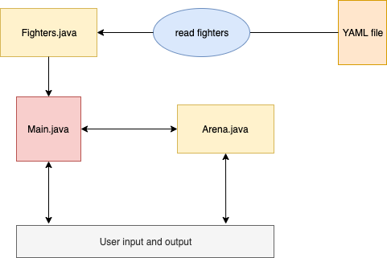
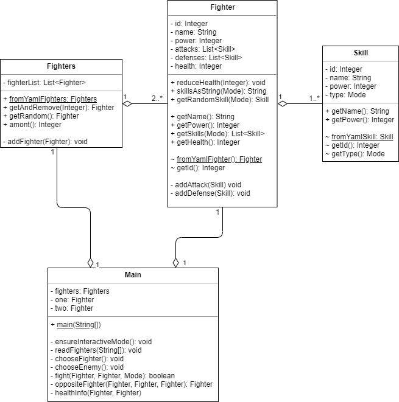

## Table of Contents

- [Overview](#overview)
- [Installation and Running](#installation-and-running)
    - [Prerequisites](#prerequisites)
    - [How to get ConsoleArena](#how-to-get-consolearena)
        - [Option 1: Cloning and building](#option-1-cloning-and-building)
            - [Without IDE](#without-ide)
            - [With IDE](#with-ide)
        - [Option 2: Downloading the JAR](#option-2-downloading-the-jar)
- [Architecture](#architecture)
    - [Java](#java)
    - [Maven](#maven)
        - [Why Maven?](#why-maven)
        - [Dependencies](#dependencies)
        - [Plugins](#plugins)
    - [Design](#design)
        - [Big Picture](#big-picture)
        - [YAML](#yaml)
        - [A fight](#a-fight)
        - [Inheritance and Polymorphism](#inheritance-and-polymorphism)
        - [Access Modifiers](#access-modifiers)
        - [Object-Orientation?](#object-orientation)
        - [Quality Management](#quality-management)
        - [More Information](#more-information)
- [Legal](#legal)

## Overview

*ConsoleArena* is a free console fighting game written in Java and is part of a school project. The game allows
you to fight against the computer. In each fight you can choose how to attack the computer. The computer than reacts
to your attack randomly. When each player has enogh health, the computer now chooses a random attack and you have to
decide how to defend.

The game is finished when one of the players has no more health.

## Installation and Running

You can clone the project [here](https://github.com/yannickkirschen/console-arena).

### Prerequisites

- Java (JRE)  \>= 1.8
- Terminal

### How to get ConsoleArena

There are two options to get *ConsoleArena*:

#### Option 1: Cloning and building

Go to https://github.com/yannickkirschen/console-arena and clone the repository. You also have to have
[Apache Maven](https://maven.apache.org/) installed. When you are checking out the repo in an IDE, such as
[IntelliJ IDEA](https://www.jetbrains.com/idea/), you don't have to install Maven.

##### Without IDE

Open the terminal and navigate to the root folder of the project (the one with the `pom.xml` inside it).

Type:

```bash
mvn clean install
```

##### With IDE

Run a new Maven configuration `clean install`.

The project is now built into `target/console-arena-VERSION.jar`. 

#### Option 2: Downloading the JAR

The easiest way of running *ConsoleArena* is to download the JAR directly.
Go to [Releases](https://github.com/yannickkirschen/console-arena/releases). Select the latest release and download the
provided JAR file.

In both ways you have to execute the JAR by:

```bash
java -jar target/console-arena-VERSION.jar

# or
java -jar console-arena-VERSION.jar fighters.yml
```

The `fighters.yml` can be provided by the user to allow custom characters.
You can find the details down below.

Have fun! The game should be self-explanatory.

## Architecture

### Java

The game is written entirely in Java. Java is an object-oriented, statically typed programming language from the early 1990s.
It has been chosen for this game, because a specification for the project has been the use of a statically typed, object-oriented
language (either Java or C#). I would have loved to implement the game in Python, which is also an object-oriented language from
the early 1990s, but is dynamically typed and has a different way of using e.g. polymorphism or inheritance.

### Maven

#### Why Maven?

Apache Maven is a build management tool written in and for Java. It allows a standardized development and management of Java
applications. Maven is based on the principle *convention over configuration*. The core of every Maven project is an XML file
called `pom.xml`. POM stands for *project object model*. The pom defines how a project should be built in the end (e.g. JAR, EAR, WAR),
and how the files in these containers should be structured. See [apache.com](http://maven.apache.org/) for more details.

#### Dependencies

The key feature of Maven (and, frankly, the reason why everybody uses it), is the use of dependencies. Dependencies are JAR-files that
have been built from a Maven project and uploaded to a repository.
The main repository is the [Maven Central Repository](https://mvnrepository.com/repos/central). It contains more than 1 million artifacts (in 2019).
It is also possible to host a private repository which makes Maven very interesting for the enterprise use, where you have code that should
not be available in public.

These are the dependencies I use for *ConsoleArena*:

- `org.yaml.snakeyaml` (v1.25) -> Parsing YAML files
- `org.slf4j.slf4j-log4j12` (v1.7.28) -> A popular logging framework

#### Plugins

Maven allows the use of plugins, that get executed when the project is being built. This allows a custom structure of the project
and an easy adoption to a companies needs.

These are the plugins I use for *ConsoleArena*:

- `org.apache.maven.plugins.maven-shade-plugin` (v3.2.1) -> Copy all dependencies into the JAR-file, making it a standalone application. Otherwise, the dependencies have to be in the classpath.
- `org.apache.maven.plugins.maven-jar-plugin` (v3.2.0) -> Set the class with the main method, so the JAR can be executed.

### Design

#### Big Picture

Here is a simply overview (*note: this is freestyle and no UML!*):



Here is a simplified UML diagram (the classes for YAML parsing are left):



#### YAML

*ConsoleArena* is (in terms of the characters) a highly customizable game. All available characters (called 'fighters') are stored in a YAML
file and read at startup. That's how the YAML file looks like:

```yaml
fighters:
    -   name: "Player 1"
        power: 18
        attacks:
            -   name: "punch"
                power: 1
            -   name: "kick"
                power: 2
        defenses:
            -   name: "shield"
                power: 1
            -   name: "run away"
                power: 2
    -   name: "Player 2"
        power: 20
        attacks:
            -   name: "punch"
                power: 1
            -   name: "kick"
                power: 2
        defenses:
            -   name: "shield"
                power: 1
            -   name: "run away"
                power: 2
```

By using this structure, the user can extend the fighters as he wants to. Each fighter gets transferred into a class called
`com.github.yannickkirschen.school.arena.fighter.Fighter`, so we end up with a list of fighters. Each fighter has methods to get several characteristics.

#### A fight

The `com.github.yannickkirschen.school.arena.Arena` is the place where the fight takes place. A fight is calculated by the formula:

*[power of skill one] + [power of player one] - [power of skill two] - [power of player two]*

The absolute value of this result is subtracted from the loser's health.

The main method (in `com.github.yannickkirschen.school.arena.Main`) controls everything. It reads the YAML file with all fighters, lets the user
choose a fighter and starts the game loop. When the user attacks, the enemy chooses its defense randomly and vice-versa.

#### Inheritance and Polymorphism

Since there is no single class for each player (they rather get dynamically load), there is no need for the use of inheritance and polymorphism.

#### Access Modifiers

Every class, method and field has the most restricting access modifier that's possible. Only the classes to parse the YAML file in
(`com.github.yannickkirschen.school.arena.fighter.YAML*`) have public getters and setters for all fields, so that the YAML parser can use them.
This is why there are some methods annotated with `SuppressWarnings("unused")`, although this is bad practise. The IDE would grumble otherwise.

The following classes can only be instantiated via a static method called `getFromYamlXXX()`:

- `com.github.yannickkirschen.school.arena.fighter.Fighter`
- `com.github.yannickkirschen.school.arena.fighter.Fighters`
- `com.github.yannickkirschen.school.arena.fighter.Skill`

This ensures, that these classes are instantiated the right way. See the UML diagram for more information.

#### Object-Orientation?

One specification for the project was the development of an object-oriented app. When you read the code (or take a look at the UML diagram), you'll
notice that there are some classes that only have static methods. I decided to not implement these classes in an object-oriented manner, because in my
opinion it looks nicer the way it is now. Utils should (almost) always be static anyway, in my opinion.

#### Quality Management

There is a unit test that tests the parsing of the YAML file with all fighters. When there is a push to GitHub, a GitHub Action launches that builds the
project with Maven (and executes the unit test), to make sure that everything regarding the structure of the project is fine.

When developing, I use the SonarLint plugin, as well as the built-in code analysis by IntelliJ, to check the code for common bad-practises. When trying to
commit, I get noticed when an issue is found and I can solve it.

#### More Information

If this documentation does not answer your questions, please refer to the JavaDoc.

## Legal

*Copyright (c) 2019, Yannick Kirschen, All rights reserved.*

This project and its documentation are licensed under the [MIT License](https://github.com/yannickkirschen/console-arena/blob/master/LICENSE).
Happy forking :)
