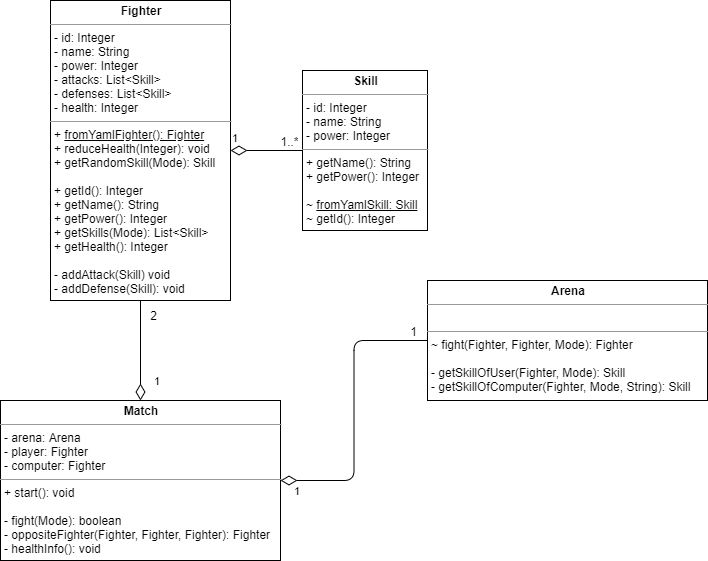

# ConsoleArena


[](https://dependabot.com)
[](https://github.com/yannickkirschen/console-arena/graphs/commit-activity)
[](https://github.com/yannickkirschen/console-arena/blob/master/LICENSE)
[](https://github.com/yannickkirschen/console-arena/releases/)

*ConsoleArena* is a free and open-source fighting game for the terminal written in Java. The style of play
is similar to that of a quartet. The game allows you to fight against the computer. In each fight you can
choose how to attack the computer. The computer than reacts to your attack randomly. When each player has
enogh health, the computer now chooses a random attack and you have to decide how to defend. The game is
finished when one of the players has no more health.

As part of a school project, this documentation intends to comply with part 2.3 from the requirements for a
documentation by the IHK (Chamber of Commerce and Industry).

## Table of Contents

- [Installation](#installation)
    - [Prerequisites](#prerequisites)
    - [Download](#download)
    - [Build](#build)
- [Play](#play)
    - [Start](#start)
    - [Fight](#fight)
- [Architecture](#architecture)
    - [Java](#java)
    - [Maven](#maven)
        - [Why Maven?](#why-maven)
        - [Dependencies](#dependencies)
        - [Plugins](#plugins)
    - [Design](#design)
    - [YAML](#yaml)
    - [Inheritance and Polymorphism](#inheritance-and-polymorphism)
    - [Access Modifiers](#access-modifiers)
    - [Object-Orientation?](#object-orientation)
    - [The logger](#the-logger)
    - [Quality Management](#quality-management)
    - [Top-Down or Bottom-Up?](#top-down-or-bottom-up)
- [More information](#more-information)
- [Legal](#legal)
    

## Installation

### Prerequisites

- Java (JRE)  \>= 1.8
- Terminal

### Download

Either clone the [repository](https://github.com/yannickkirschen/console-arena) or go to
[Releases](https://github.com/yannickkirschen/console-arena/releases) and download the latest JAR-file.

### Build

If you've cloned the repository, you have to build it with Maven (more on Maven [here](#maven)):

```bash
mvn clean install
cd target
``` 

## Play

### Start

```bash
java -jar console-arena-VERSION.jar

# or
java -jar console-arena-VERSION.jar fighters.yml
```

The `fighters.yml` can be provided by the user to allow custom characters.
You can find the details [here](#yaml). Please note that cou cannot start the game in a non-interactive mode such
as the terminal of an IDE. Please use your system's default terminal.

Once you started the JAR, you'll get this screen:

```
Choose a player:
0 - Vader (Power: 18)
1 - Yoda (Power: 20)

>
```

This is a list of all available players and their power. Whenever you see the `>` you can make an input.
So, choose the fighter you want to play with (either `0` or `1`) and press enter.

You'll get a little summary. The enemy is chosen randomly out of the remaining fighters. In our case, there is just
one choice.

```
You've gone for player 'Yoda'.
You are fighting against 'Vader'.
Press any key to continue. You can press 'q' at any point in the game to quit.
``` 

### Fight

As long as both fighters have a health greater than 0, the game loop runs. Each fight has the following steps:

1. You choose an attack.
2. The computer randomly chooses a defense.
3. The result gets calculated.
4. The computer randomly chooses an attack.
5. You choose a defense.
6. The result gets calculated.

The `com.github.yannickkirschen.school.arena.Arena` is the place where the fight takes place. A fight is
calculated by the formula:

*[power of skill one] + [power of player one] - [power of skill two] - [power of player two]*

When the result is positive, player one won the fight, otherwise player two.
The absolute value of this result is subtracted from the loser's health.

## Architecture

### Java

The game is written entirely in Java. Java is an object-oriented, statically typed programming language from the early 1990s.
It has been chosen for this game, because a specification for the project has been the use of a statically typed,
object-oriented language (either Java or C#). I would have loved to implement the game in Python, which is also an
object-oriented language from the early 1990s, but is dynamically typed and has a different way of using e.g.
polymorphism or inheritance.

### Maven

#### Why Maven?

Apache Maven is a build management tool written in and for Java. It allows a standardized development and management
of Java applications. Maven is based on the principle *convention over configuration*. The core of every Maven project
is an XML file called `pom.xml`. POM stands for *project object model*. The pom defines how a project should be built
in the end (e.g. JAR, EAR, WAR), and how the files in these containers should be structured. See
[maven.apache.com](http://maven.apache.org/) for more details.

#### Dependencies

The key feature of Maven (and, frankly, the reason why everybody uses it), is the use of dependencies. Dependencies
are JAR-files that have been built from a Maven project and uploaded to a repository.
The main repository is the [Maven Central Repository](https://mvnrepository.com/repos/central). It contains more than
5 million artifacts (as of May 2020). It is also possible to host a private repository which makes Maven very interesting
for enterprise use, where you have code that should not be available in public.

These are the dependencies I use for *ConsoleArena*:

- `org.yaml.snakeyaml` (v1.25) -> Parsing YAML files
- `org.slf4j.slf4j-log4j12` (v1.7.28) -> A popular logging framework

#### Plugins

Maven allows the use of plugins, that get executed when the project is being built. This allows a custom structure of
the project and an easy adoption to a companies needs.

These are the plugins I use for *ConsoleArena*:

- `org.apache.maven.plugins.maven-shade-plugin` (v3.2.1) -> Copy all dependencies into the JAR-file, making it a standalone application. Otherwise, the dependencies have to be in the classpath.
- `org.apache.maven.plugins.maven-jar-plugin` (v3.2.0) -> Set the class with the main method, so the JAR can be executed.

### Design

Here is a simple overview (*note: this is freestyle and no UML!*):


Down below is a simplified UML class-diagram. To focus on the relevant part of the application (where the actual business logic happens),
the classes for YAML parsing are left in this diagram. I chose a class diagram in favour of other popular diagrams such as an activity
or interaction overview diagram because it is an easy way to show the structure of an application and the relations between objects. You can directly
see what classes are involved and can dive right into the code. Other diagrams can be used as a specialization.

Often, you only reveal the public fields and methods, to show how your objects can be accessed. I decided to reveal all fields and methods, because
it often helps understanding how an application works.

Since a class diagram should only display the relations between objects, utils, enums, and the class with the main method are left out.



The main method (in `com.github.yannickkirschen.school.arena.Main`) starts the game. It reads the fighters from the YAML file, lets the
user choose a fighter and randomly chooses a fighter as the enemy.

Finally, the main match loop is started.

### YAML

*ConsoleArena* is (in terms of the characters) a highly customizable game. All available characters (called 'fighters')
are stored in a YAML file and read at startup. That's how the YAML file looks like:

```yaml
fighters:
    -   name: "Player 1"
        power: 18
        attacks:
            -   name: "punch"
                power: 1
            -   name: "kick"
                power: 2
        defenses:
            -   name: "shield"
                power: 1
            -   name: "run away"
                power: 2
    -   name: "Player 2"
        power: 20
        attacks:
            -   name: "punch"
                power: 1
            -   name: "kick"
                power: 2
        defenses:
            -   name: "shield"
                power: 1
            -   name: "run away"
                power: 2
```

By using this structure, the user can extend the fighters as he wants to. Each fighter gets transferred into a class called
`com.github.yannickkirschen.school.arena.fighter.Fighter`, so we end up with a list of fighters. Each fighter has methods
to get several characteristics.

### Inheritance and Polymorphism

Since there is no single class for each player (they rather get load dynamically), there is no need for the use of
inheritance and polymorphism.

In fact, inheritance is quite outdated nowadays. The experience over the years showed that inheritance causes a lot of
problems that are out of all proportion to the advantages. See
[Liskov substitution principle](https://en.wikipedia.org/wiki/Liskov_substitution_principle) for more details.
Today, the trend is more a mixture of procedural and object-oriented code, like Python supports it. By using this
strategy, you combine the advantages of both paradigms.

### Access Modifiers

Every class, method and field has the most restricting access modifier that's possible. Only the classes to parse the YAML
file in (`com.github.yannickkirschen.school.arena.fighter.YAML*`) have public getters and setters for all fields, so that
the YAML parser can use them. This is why there are some methods annotated with `SuppressWarnings("unused")`, although
this is bad practise. The IDE would grumble otherwise.

The following classes can only be instantiated via a static method called `getFromYamlXXX()`:

- `com.github.yannickkirschen.school.arena.fighter.Fighter`
- `com.github.yannickkirschen.school.arena.fighter.Skill`

This ensures, that these classes are instantiated the right way. See the UML diagram for more information.

### Object-Orientation?

One specification for the project was the development of an object-oriented app. When you read the code, you'll notice that
`com.github.yannickkirschen.school.arena.ConsoleUtil` only has static methods. I decided to not implement this class in an
object-oriented manner, because in my opinion it looks nicer the way it is now. I like simple utils to be static.

### The logger

I use [Log4j](https://logging.apache.org/log4j/2.x/) for logging. When you play the game you'll notice that there are no
"real" log messages (at least not one of those you are used to). Instead, I use the logging framework as a centralized way
to control the output. The file `src/main/resources/log4j.properties` contains the properties for the logger. Inside this,
you can see that the default target is set to `System.out`, which means that every call to the logger will be redirected
to the default console. You could also configure this to write into a log file. You can see that the pattern of the output
is `%m%n`. So each call to the logger would print the message (`%m`) and a new line (`%n`). Usually, you would use
something like `[%d{yyyy-MM-dd HH:mm:ss}] %-5p %c{1} - %m%n` as the pattern which contains additional information such as
the date and the time.

Why do I use a logger instead of `System.out`? As I'm going to explain in the next paragraph, I use SonarLint for quality
management. This plugin scans the code and marks common bad practices. Although you should check if a finding is really
bad practice for your use-case, the plugin is often right. The use of `System.out` is seen as such a bad practice and
SonarLint suggests to replace it by a logger. By doing this is, you are able to change the look of the output at one
central place. Though I have to admit that `System.out` vs. a proper logger is definitely one of those endless
controversial issues among developers.

### Quality Management

There is a unit test that tests the parsing of the YAML file with all fighters. When there is a push to GitHub, a GitHub
Action launches that builds the project with Maven (and executes the unit test), to make sure that everything regarding
the structure of the project is fine.

When developing, I use the SonarLint plugin, as well as the built-in code analysis by IntelliJ, to check the code for
common bad-practises. When trying to commit, I get noticed when an issue is found and I can solve it.
I chose these tools because they are the default ones for IntelliJ and there are no notable alternatives. Furthermore,
SonarLint is compatible to the SonarQube server at work, where our build tool lints the code while building a project.
You are able to connect SonarLint to the SonarQube server, so you have the same settings as in the build process later on.

### Top-Down or Bottom-Up?

During the implementation, I followed the bottom-up strategy. This agile approach allowed me to start implementing and testing
the game very fast. Through 'inspect & adapt' I continuously thought about potential issues and thus improved the application.
Since I've been working on my own, bottom-up was the only practicable way of working.

## More Information

If this documentation does not answer your questions, please refer to the Javadoc.
You'll better start [here](https://github.com/yannickkirschen/console-arena/blob/master/src/main/java/com/github/yannickkirschen/school/arena/Main.java).

See also:

- [Contributing](https://github.com/yannickkirschen/console-arena/blob/master/CONTRIBUTING.md)
- [Code of conduct](https://github.com/yannickkirschen/console-arena/blob/master/CODE_OF_CONDUCT.md)
- [Changelog](https://github.com/yannickkirschen/console-arena/blob/master/CHANGELOG.md)

## Legal

*Copyright (c) 2019, Yannick Kirschen, All rights reserved.*

This project and its documentation are licensed under the [MIT License](https://github.com/yannickkirschen/console-arena/blob/master/LICENSE).
Happy forking :)
